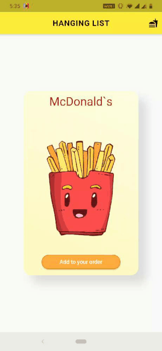

# Food Order

A Flutter application where whe have list of restaurants as `HangingList` with animation on scrolling. Here we also have `HangingItems` which you can rotate like a hanger and you can also play with their flip property.
The idea is taken from hanging clothes in almirah.

 

## Getting Started

Go to project directory and run `flutter run`.
